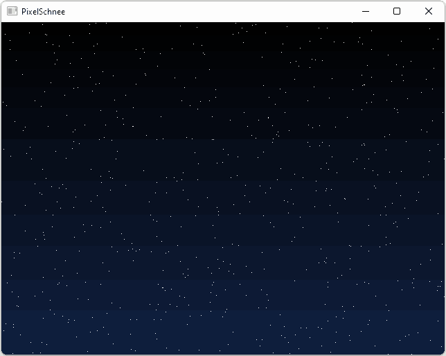

# PixelSchnee

This is a small and simple SFML demo drawing some simple pixel snow to your desktop background.
It's a quick hack job to surprise a friend, so don't expect any major software engineering.

**Note:** While this should in theory compile and work on X11, so far I only got it to work properly on Windows 10 and Windows 11.

## What's with the name?

**Schnee** is the German term for **snow**, so this is really just **pixel snow**, just with actually wrong casing (it should read **Pixelschnee**).

## Compiling

You'll need both [SFML](https://www.sfml-dev.org/) and [CMake](https://www.cmake.org/).

Create your solution or makefile using CMake:

    cmake path/to/source

Then just build the program by opening the generated solution file or run your build tool, e.g. by executing `make`.

## Debug vs. Release

In debug builds, the program will show a regular SFML window. This is intentional.

To actually draw to the desktop background, you'll have to create a release build.

Depending on your build tools, you'll either have to set CMake's `CMAKE_BUILD_TYPE` variable to `Release` or pick the Release build option in your IDE.

To set `CMAKE_BUILD_TYPE on the command line:

    cmake -DCMAKE_BUILD_TYPE=Release path/to/source/or/build/directory

## Running/Using

Simply execute the program. You should see snow falling on your desktop. To stop/end, just hit <kbd>Windows</kbd>+<kbd>F4</kbd>.

## Known Issues

Ending the program won't reset/redraw your background, it will be fine next login (or whenever you change it).
